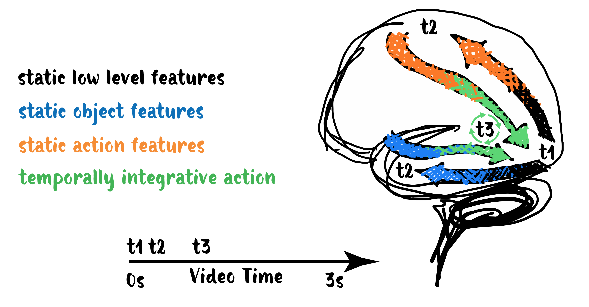
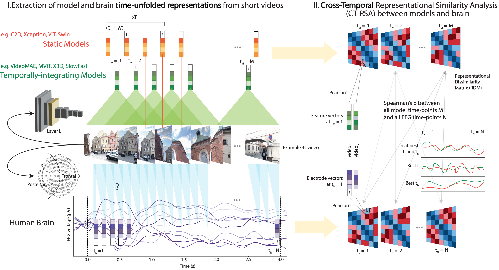
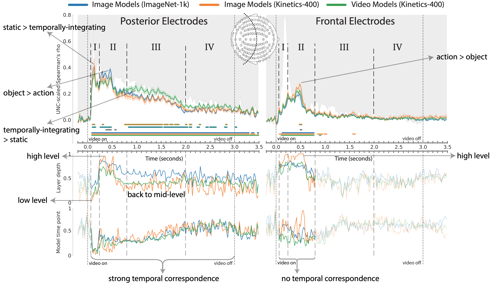
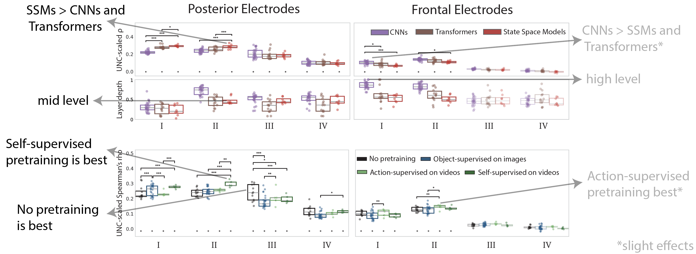

# TL;DR

So far, there are studies of either fine-grained dynamic responses to **static image stimuli** [1] or **slow fMRI** responses to video, often employing large-scale DNN alignment comparisons [2].

Question:
How does DNN alignment to **fine-grained dynamic neural representations** evolve beyond static stimuli **during video watching**?

## Human brain during video watching



Answer:
The brain does not resemble a single DNN type across time.
It switches between semantic tasks and temporal integration, analogous to a dynamic mixture of expert models.
The brain returns to mid-level features after high-level semantics, challenging the conventional temporal processing hierarchy.

# Aligning 100+ DNNs and EEG responses to video with CT-RSA



First benchmarking to video EEG
• new EEG Moments Dataset, same videos as Bold Moments Dataset [3]
• test set of 102 videos w. 24 repeats
• deep sampling in 6 subjects
• 35 posterior, 54 frontal electrodes

100+ image & video models
• 44 image object (ImageNet-1k)
• 10 image action (Kinetics-400)
• 49 video action (Kinetics-400)
👉 isolated effects of task and temporal integration

CT-RSA: Cross-Temporal extension of RSA [4]
max, argmax (RSA between all EEG timepoints 
and all model timepoints + layers)
• EEG RDM is subject average.
Model RDM from features reduced to
100 dimensions (SRP+PCA).

# The brain switches between semantic tasks and temporal integration



# Better alignment of state-space models and self-supervised pretraining



# What does this mean for human vision?
- Our results challenge the idea of a strict temporal hierarchy as seen in image perception [1], uncovering an additional phase of mid-level action feature processing until the end of the video
- This phase occurs after high-level action feature processing seen in frontal electrodes, revealing possible role of feedback [5] 

# What does this mean for Video AI?
- A single DNN would be best aligned with the brain if trained with a sufficiently general objective to develop experts for different semantic tasks and modes of temporal integration
- Enabling dynamic switching between these experts may yield human-like capabilities such as efficiency

# What's next?
- Model-based EEG-fMRI fusion [6] to see which brain regions are involved when, connecting to findings in fMRI studies [2]
  - Is the mid-level temporal integration of stage III in EVC?
  - Does action recognition involve prefrontal regions?
- Neuro-inspired video architecture via implementations of dynamic mixture of experts, feedback for dynamic routing
- Extending the representational alignment benchmarking to:
  - More recurrent architectures (SSMs, LRUs, RNNs)
  - Intermediate duration videos (10-20s) with elements of visual surprise and scene cuts
- Collection of more large scale video EEG datasets

# References
[1] Cichy et al., 2016. Comparison of deep neural networks to spatio-temporal cortical dynamics of human visual object recognition reveals hierarchical correspondence. Scientific reports.

[2] Sartzetaki et al., 2025. One hundred neural networks and brains watching videos: Lessons from alignment. In The Thirteenth International Conference on Learning Representations.

[3] Lahner et al., 2024. Modeling short visual events through the BOLD moments video fMRI dataset and metadata. Nature communications.

[4] Kriegeskorte et al., 2008. Representational similarity analysis connecting the branches of systems neuroscience. Frontiers in Systems Neuroscience.

[5] Oyarzo et al., 2025. Adaptive recruitment of cortex-wide recurrence for visual object recognition. bioRxiv.

[6] Hebart et al., 2018. The representational dynamics of task and object processing in humans. elife.

# BibTeX
```
@inproceedings{
  sartzetaki2026the,
  title={The Human Brain as a Dynamic Mixture of Expert Models in Video Understanding},
  author={Christina Sartzetaki and Anne W. Zonneveld and Pablo Oyarzo and Alessandro Thomas Gifford and Radoslaw Martin Cichy and Pascal Mettes and Iris Groen},
  booktitle={The Fourteenth International Conference on Learning Representations},
  year={2026},
  url={https://openreview.net/forum?id=bSsNSfyj8m}
}
```
